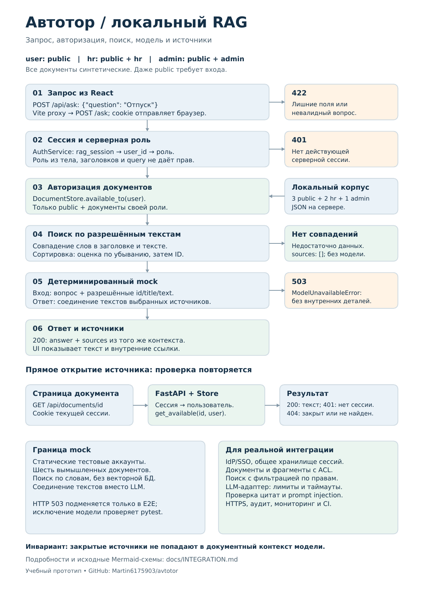
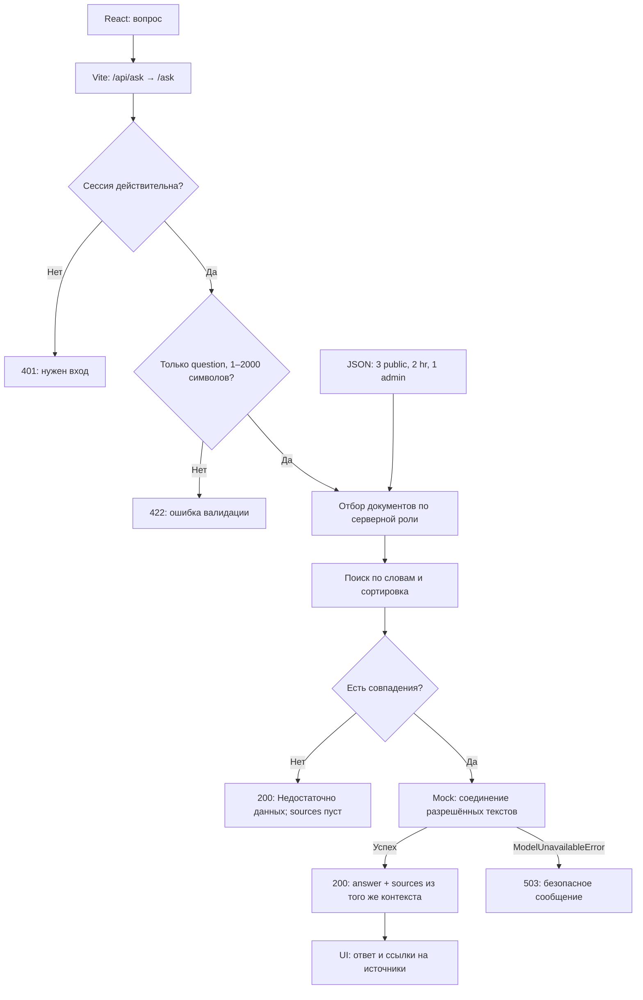
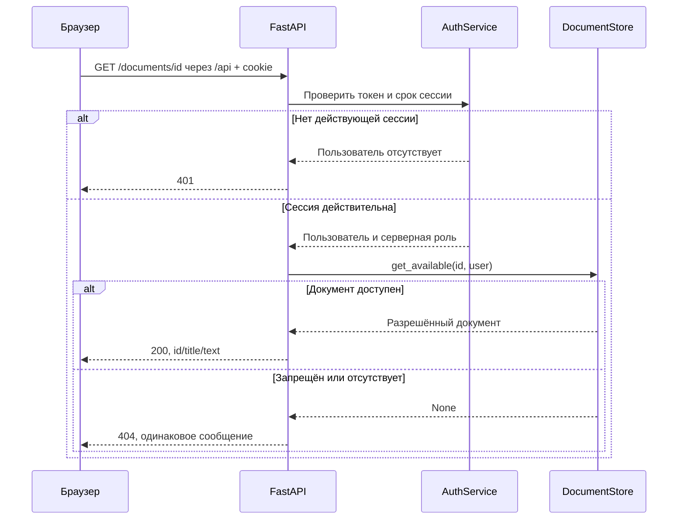

# Интеграция интерфейса и локального RAG

[Одностраничная схема PDF](integration.pdf) · [Версия PNG](integration.png) · [README](../README.md)



## Запрос ответа



Это логическая схема границ проверки, а не обещание приоритета всех ошибок FastAPI при одновременно неверном JSON и отсутствующей сессии. Синтаксический разбор запроса выполняется фреймворком; поиск и модель запускаются только после успешных проверок.

### Граница доверия

Клиент передаёт вопрос и автоматически отправляемую браузером cookie. `AuthService` разрешает случайный токен `rag_session` в серверного пользователя; роль определяется по серверной записи пользователя. Данные UI не являются источником полномочий.

`POST /ask` запрещает дополнительные поля тела. Заголовок `X-Role` и query-параметр `role` не используются для расширения доступа. Доступ к общедоступным документам также требует действующей сессии.

Ключевой инвариант: **документы, из которых выполняются поиск, формирование контекста модели и построение ссылок, уже отфильтрованы по правам пользователя**. Закрытые тексты не передаются модели с инструкцией «не показывать» — они вообще не включаются в её документный контекст.

### Контекст и ссылки

В модель поступают `question` и последовательность `SourceContext(id, title, text)`. Mock соединяет все переданные тексты через `\n\n`. Сервер формирует `sources` из этой же последовательности, поэтому каждая ссылка соответствует использованному документу. Модель не генерирует ID и URL самостоятельно.

Если совпадений нет, ответ «Недостаточно данных» формируется без вызова модели. Одинаковые вопрос, права и корпус дают одинаковый результат; при равной оценке порядок определяется ID документа.

## Прямое открытие источника



Страница UI `/documents/{id}` и API-метод `/documents/{id}` существуют на разных портах. Браузерная страница получает текст через `/api/documents/{id}`. Наличие ссылки, знание ID или ручной ввод URL не заменяют проверку на сервере.

## Границы mock и переход к реальной интеграции

| Компонент | В прототипе | Для реальной интеграции |
| --- | --- | --- |
| Идентификация | 3 статические тестовые записи | Корпоративный IdP/SSO либо полноценная аутентификация; проверяемые сервером идентификаторы и роли |
| Сессии | Случайные токены, память одного процесса, TTL 1 час | Общее хранилище сессий, отзыв и ротация, HTTPS и production-cookie |
| Корпус | 6 синтетических JSON-документов | Загрузка и версионирование, хранение метаданных, ACL каждого документа и фрагмента |
| Поиск | Пересечение слов, сортировка по оценке и ID | При необходимости embeddings, полнотекстовый/векторный поиск и reranking; обязательное сохранение ACL до контекста модели |
| Генерация | Синхронное соединение текстов | Адаптер локальной/разрешённой LLM, асинхронное выполнение или вынос блокирующего вызова, лимиты контекста, таймауты и отмена |
| Источники | Все контексты использованы mock; ссылки создаёт сервер | Проверяемые цитаты по разрешённым ID, отсечение выдуманных источников, связь фрагментов с версиями документов |
| Ошибки | Безопасный 503 для `ModelUnavailableError`; один E2E с подменой HTTP | Нормализация ошибок провайдера, политика повторов, наблюдаемость без утечек текстов и токенов |
| Эксплуатация | Один FastAPI-процесс и Vite dev server | Reverse proxy, раздача SPA, защищённая конфигурация, CI, аудит и мониторинг |

Для реальной модели отдельно нужны проверки prompt injection, качества ответов и утечек между ролями/организациями. Кэш должен учитывать права, версию корпуса и изменение доступа. Повторная авторизация прямого открытия источников сохраняется при любой замене поискового или модельного компонента.

## Где это реализовано

- `backend/app/auth/dependencies.py`, `auth/service.py`: проверка сессии и серверная идентичность.
- `backend/app/documents/store.py`: общее правило доступа и загрузка корпуса.
- `backend/app/rag/service.py`: фильтрация, ранжирование, контекст и источники.
- `backend/app/rag/model.py`: `AnswerModel`, mock и `ModelUnavailableError`.
- `backend/app/documents/routes.py`: защищённое чтение документа.
- `frontend/src/services/http`: запросы, ошибки и проверка ответов.
- `backend/tests/test_rag.py`: контроль контекста модели, матрица доступа и безопасные ошибки.
- `frontend/e2e/rag.spec.ts`: проверка всего пути от формы до источника.

## Обновление печатной схемы

Mermaid-диаграммы выше редактируются прямо в этом файле. Для воспроизводимого обновления PDF сохранён `docs/render_integration.py`. Его инструменты не нужны для запуска приложения: установите `reportlab` в отдельное окружение для документации и обеспечьте наличие шрифтов `DejaVuSans.ttf` и `DejaVuSans-Bold.ttf`. При нестандартном расположении задайте переменную `RAG_DIAGRAM_FONT_DIR` с каталогом этих файлов.

Из корня репозитория:

```bash
python docs/render_integration.py
pdftoppm -scale-to 1600 -singlefile -png docs/integration.pdf docs/integration
```

Вторая команда использует Poppler и обновляет PNG для просмотра на GitHub. После изменения проверьте, что PDF по-прежнему содержит одну страницу, текст читается и совпадает с Mermaid-схемами.
